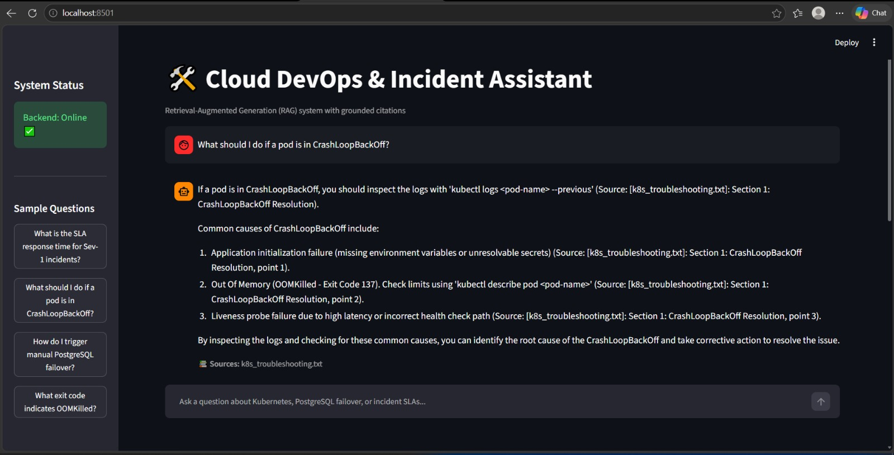
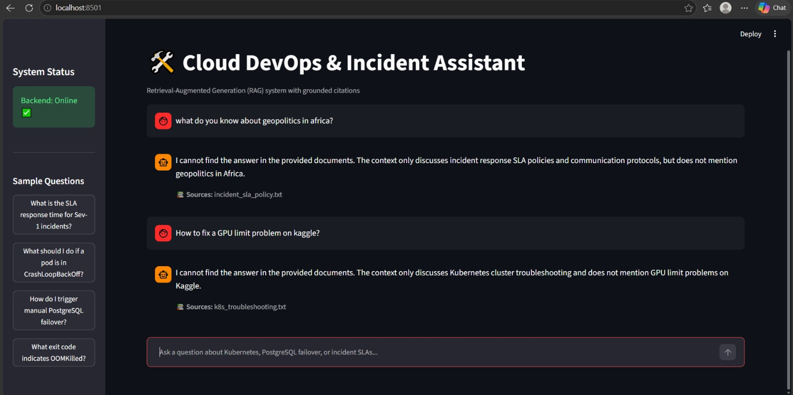

# 🛠️ RAG-Powered DevOps Assistant

An end-to-end Retrieval-Augmented Generation (RAG) assistant that answers technical questions grounded in documentation (Kubernetes troubleshooting, PostgreSQL recovery, and Incident SLAs) using a local Ollama LLM.

---

## 📸 Application Demo




---

## 🏛️ Architecture Overview

```
┌─────────────────────────┐
│ Streamlit Web Frontend  │  (Port 8501)
└───────────┬─────────────┘
            │  POST /query
            ▼
┌─────────────────────────┐
│     FastAPI Backend     │  (Port 8000)
└─────┬─────────────┬─────┘
      │             │
      ▼             ▼
┌──────────────┐  ┌─────────────────────────────────┐
│ ChromaDB     │  │ SentenceTransformers           │
│ Vector Store │  │ (all-MiniLM-L6-v2 Embeddings)   │
└──────────────┘  └─────────────────────────────────┘
      │
      ▼ Context + Grounded Prompt
┌─────────────────────────┐
│ Local Ollama LLM        │  (llama3.2:3b)
└─────────────────────────┘
```

---

## 💻 Tech Stack
- **LLM Engine:** Ollama (`llama3.2:3b`)
- **Embedding Model:** `sentence-transformers/all-MiniLM-L6-v2` (384-dimensional dense vectors)
- **Vector Database:** ChromaDB (persistent local store)
- **Backend API:** FastAPI, Uvicorn, Pydantic v2
- **Frontend UI:** Streamlit
- **Testing:** Pytest, HTTPX

---

## 📂 Project Structure
```
rag-assistant-project/
├── .gitignore
├── README.md
├── screenshot.png
├── notebooks/
│   └── rag_pipeline.ipynb          # Clean, chunk, embed, test, and evaluate
├── backend/
│   ├── app/
│   │   ├── main.py                 # FastAPI app & lifespan initialization
│   │   ├── api/routes/query.py     # /health and /query endpoints
│   │   ├── core/config.py          # Settings from .env
│   │   ├── schemas/query.py        # Pydantic schemas (QueryRequest / QueryResponse)
│   │   ├── services/
│   │   │   ├── retrieval.py        # Vector search retrieval
│   │   │   └── generation.py       # Prompt crafting & Ollama caller
│   │   └── utils/logging_config.py
│   ├── data/vector_store/          # Persisted ChromaDB storage
│   ├── tests/test_query.py         # Pytest test suite
│   ├── requirements.txt
│   ├── .env.example
│   └── Dockerfile
└── frontend/
    ├── app.py                      # Streamlit chat interface
    ├── api_client.py               # Backend API connection layer
    ├── .env.example
    └── requirements.txt
```

---

## ⚙️ Environment Variables
| Variable | Default Value | Description |
|---|---|---|
| `OLLAMA_MODEL` | `llama3.2:3b` | Target local model in Ollama |
| `OLLAMA_BASE_URL` | `http://localhost:11434` | Ollama daemon endpoint |
| `CHROMA_PERSIST_DIR` | `data/vector_store` | Path to ChromaDB storage |
| `API_BASE_URL` | `http://localhost:8000` | Backend API URL for frontend |

---

## 🚀 Setup & Execution Guide

### 1. Prerequisites
Ensure Ollama is running and the model is pulled:
```bash
ollama run llama3.2:3b
```

### 2. Environment Setup
```bash
python -m venv .venv
# On Windows:
.\.venv\Scripts\Activate.ps1
# On macOS/Linux:
# source .venv/bin/activate

pip install -r backend/requirements.txt
pip install -r frontend/requirements.txt
```

### 3. Generate Data & Vector Store
```bash
python prepare_data.py
python generate_notebook.py
jupyter nbconvert --to notebook --execute notebooks/rag_pipeline.ipynb --inplace
```

### 4. Run Backend & Pytest
```bash
cd backend
python -m pytest tests/ -v
uvicorn app.main:app --host 0.0.0.0 --port 8000 --reload
```

### 5. Run Frontend
In a separate terminal:
```bash
cd frontend
streamlit run app.py
```

---

## 📡 API Reference & cURL Example

### Health Check
```bash
curl -X GET "http://localhost:8000/health"
```
**Response:**
```json
{"status": "ok", "service": "RAG Backend"}
```

### Query Endpoint
```bash
curl -X POST "http://localhost:8000/query" \
     -H "Content-Type: application/json" \
     -d "{\"question\": \"What is the SLA response time for Sev-1 incidents?\"}"
```
**Response:**
```json
{
  "answer": "According to the Incident Response SLA policy, Severity 1 (Critical) incidents have an SLA response time of less than 15 minutes, with updates required every 30 minutes.",
  "sources": ["incident_sla_policy.txt"]
}
```

---

## 📊 Evaluation Results
| # | Test Question | Retrieved Source | Grounded? |
|---|---|---|---|
| 1 | What is the SLA response time for Sev-1 incidents? | `incident_sla_policy.txt` | Yes |
| 2 | What command checks previous logs for CrashLoopBackOff? | `k8s_troubleshooting.txt` | Yes |
| 3 | What exit code indicates an OOMKilled pod? | `k8s_troubleshooting.txt` | Yes |
| 4 | How many etcd nodes are needed for PostgreSQL Patroni quorum? | `database_failover.txt` | Yes |
| 5 | Which command initiates manual database failover? | `database_failover.txt` | Yes |
| 6 | What port does PgBouncer run on? | `database_failover.txt` | Yes |
| 7 | How soon must an incident RCA post-mortem be published? | `incident_sla_policy.txt` | Yes |
| 8 | What slack channel is used for critical war rooms? | `incident_sla_policy.txt` | Yes |
| 9 | What should be checked if a Kubernetes node is NotReady? | `k8s_troubleshooting.txt` | Yes |
| 10 | What is the maximum allowed replication lag for forced failover? | `database_failover.txt` | Yes |
| 11 | What do you know about geopolitics in Africa?	|incident_sla_policy.txt (Low similarity) |	Correct (Refusal) |
| 12 |	How to fix a GPU limit problem on Kaggle? |	k8s_troubleshooting.txt (Low similarity) |	Correct (Refusal) |
| 13 |	How do I configure Redis Sentinel failover? |	database_failover.txt (Low similarity) | Correct (Refusal) |
